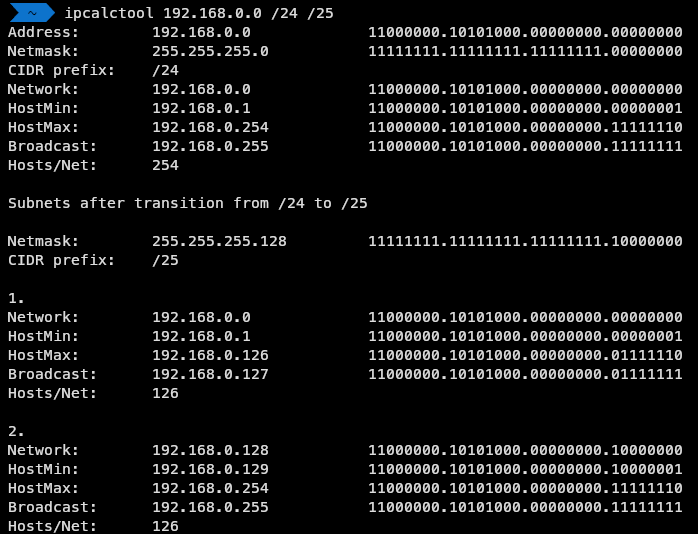

# ipcalctool

> C++ cli program to calculate IPv4 subnets 

[](https://opensource.org/licenses/MIT)

A C++ program that helps you subnet a network



## Installation

compile with gcc

```sh
g++ main.cpp -o ipcalctool
```

## Usage example

### To get help with commandline arguments

```sh
ipcalctool -h
```

or

```sh
ipcalctool --help
```

### Using commandline arguments

set an address with "-a"

```sh
ipcalctool -a 192.168.0.0
```

set a netmask with "-m"

```sh
ipcalctool -m /24
```

set a subnet netmask with "-s"

```sh
ipcalctool -s /26
```
