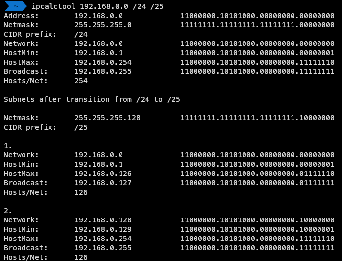

# ipcalctool

> C++ cli program to calculate IPv4 subnets 

[](https://opensource.org/licenses/MIT)

A C++ program that helps you subnet a network  
Uses [my cli parser](https://github.com/matyassykora/cppclip)



## Installation

compile with gcc

```sh
g++ main.cpp -o ipcalctool
```

## Usage examples

```sh
ipcalctool 192.168.0.0 /16 /18
ipcalctool 192.168.0.0 255.255.255.0 /26
```

### To get help with commandline arguments

```sh
ipcalctool -h
```

or

```sh
ipcalctool --help
```
